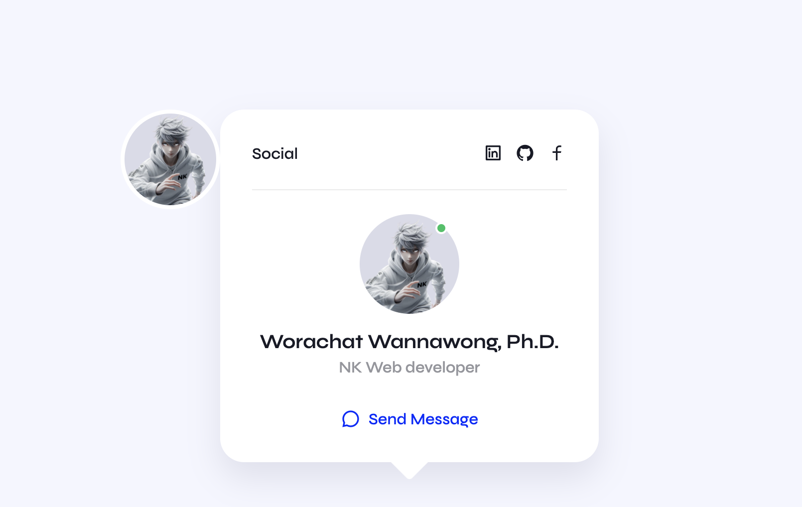

# Profile Card 2024 : UX/UI Student-Dev. 

A modern and responsive profile card designed to showcase UX/UI and web development skills. This project includes social media links, a profile image, and a call-to-action button, making it a great way to highlight your professional profile.



## Features

- **Responsive Design**: Adapts to different screen sizes, ensuring usability on both desktop and mobile devices.
- **Social Links**: Icons for LinkedIn, GitHub, and Facebook, allowing easy access to your social profiles.
- **Profile Information**: Displays a profile image, name, profession, and a button to send a message.

## Project Structure

- **HTML**: Contains the structure of the profile card.
- **CSS**: Provides the styling to enhance the visual appearance.
- **Assets**: Includes images and CSS files used in the project.

### Directory Layout

```markdown
.
├── assets
│   ├── css
│   │   └── styles.css  # CSS for styling the profile card
│   └── img
│       └── profile.png # Placeholder profile image
└── index.html          # Main HTML file
```

## HTML Structure

The main structure of the profile card is defined in `index.html`:

```html
<!DOCTYPE html>
<html lang="en">

<head>
    <meta charset="UTF-8">
    <meta name="viewport" content="width=device-width, initial-scale=1.0">
    <link rel="shortcut icon" type="image/x-icon" href="favicon.ico">
    <link rel="preconnect" href="https://fonts.googleapis.com">
    <link rel="preconnect" href="https://fonts.gstatic.com" crossorigin>
    <link rel="stylesheet" href="https://cdnjs.cloudflare.com/ajax/libs/remixicon/4.0.1/remixicon.css">
    <link rel="stylesheet" href="assets/css/styles.css">
    <title>UX/UI Student-Dev. Profile Card 2024</title>
</head>

<body>
    <div class="container">
        <article class="card">
            <div class="card__profile">
                
            </div>
            <div class="card__content">
                <header class="card__header">
                    <span>Social</span>
                    <div class="card__social">
                        <a href="https://www.linkedin.com/in/brainwaves-your-ai-playground-82155961/" target="_blank">
                            <i class="ri-linkedin-box-line"></i>
                        </a>
                        <a href="https://github.com/worachat-dev" target="_blank">
                            <i class="ri-github-fill"></i>
                        </a>
                        <a href="https://web.facebook.com/NutriCious.Thailand" target="_blank">
                            <i class="ri-facebook-line"></i>
                        </a>
                    </div>
                </header>
                <div class="card__details">
                    <div class="card__image">
                        <div class="card__mask">
                            
                        </div>
                        <span class="card__status"></span>
                    </div>
                    <h2 class="card__name">Worachat Wannawong, Ph.D.</h2>
                    <h3 class="card__profession">Web Developer</h3>
                    <a href="#" class="card__button">
                        <i class="ri-chat-3-line"></i> <span>Send Message</span>
                    </a>
                </div>
            </div>
        </article>
    </div>
</body>

</html>
```

## Setup

### 1. Clone the Repository

To clone the repository, use the following command in your terminal:

```bash
git clone https://github.com/your-username/nk-profile-card.git
```

### 2. Open in Browser

Navigate to the project directory and open `index.html` in your preferred web browser to view the profile card.

## Dependencies

- **Remix Icons**: Utilizes the [Remix Icon Library](https://remixicon.com/) for social media icons.
- **Google Fonts**: Loads fonts from [Google Fonts](https://fonts.google.com/).

## Customization

- **Profile Image**: Replace the image at `assets/img/profile.png` with your own profile picture.
- **Social Links**: Update the URLs in the social links section of the HTML to your own social profiles.
- **CSS Styles**: Modify the `assets/css/styles.css` file to change the appearance of the profile card according to your preferences.

## Contributing

Contributions are welcome! If you have any suggestions or improvements, feel free to submit an issue or a pull request. Follow these steps to contribute:

1. Fork the repository.
2. Create a new branch (`git checkout -b feature-branch`).
3. Commit your changes (`git commit -m 'Add new feature'`).
4. Push to the branch (`git push origin feature-branch`).
5. Open a pull request.

## License

This project is open-source and available under the [MIT License](LICENSE).

## Acknowledgments

This project was inspired by the [Profile Card with Tooltip](https://github.com/bedimcode/profile-card-with-tooltip) by Marlon bedimcode. The original design provided a solid foundation for creating a modern and interactive profile card. Special thanks to Bedimcode for sharing their project and contributing to the web design community.

## Author

**Worachat Wannawong, Ph.D.**  
[LinkedIn](https://www.linkedin.com/in/brainwaves-your-ai-playground-82155961/) | [GitHub](https://github.com/worachat-dev) | [Facebook](https://web.facebook.com/NutriCious.Thailand)
```

### Overview:

- **Introduction**: Briefly explains what the project is about and its purpose.
- **Features**: Highlights the key features of the profile card.
- **Project Structure**: Details the file structure and main components.
- **HTML Structure**: Provides the main HTML code for the profile card.
- **Setup Instructions**: Guides users on how to clone and view the project.
- **Dependencies**: Lists external libraries used in the project.
- **Customization**: Offers tips on how to personalize the profile card.
- **Contributing**: Describes how others can contribute to the project.
- **License**: Mentions the project's license.
- **Acknowledgments**: Credits the original inspiration for the project.
- **Author Information**: Provides links to the author’s social profiles.

Feel free to adjust any section as per your needs or to better fit the specifics of your project!
